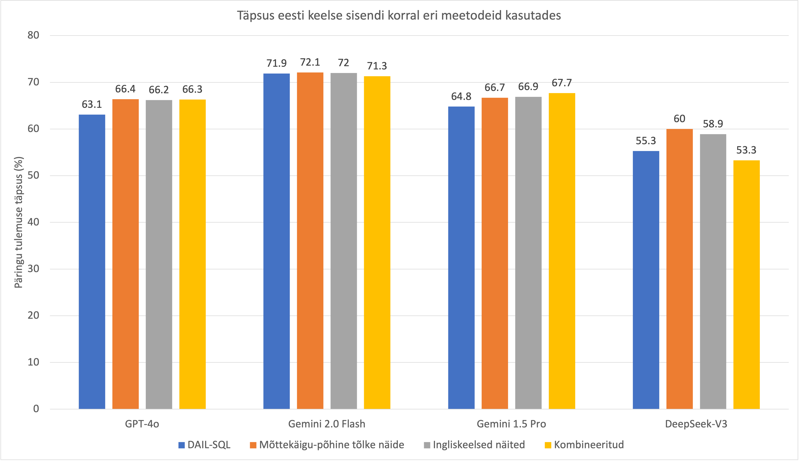

# Eesti keeles SQL SELECT lausete genereerimine suurte keelemudelite abil

See projekt on magistritöö "Eesti keele kasutamine suurte keelemudelite abil SQL-andmebaasidelst otsingute tegemiseks" 
raames loodud tarkvara ja materjalide kogum. Töö keskendub suurte keelemudelite (LLM) võimekusele tõlkida 
loomulikus eesti keeles esitatud küsimusi SQL SELECT lauseteks. 
Projekti aluseks on [DAIL-SQL raamistik](https://github.com/BeachWang/DAIL-SQL), 
mida on kohandatud ja täiendatud eestikeelsete andmetega testimiseks ning erinevate täpsust parandavate meetodite 
uurimiseks.

Peamised laiendused:
- Gemini & DeepSeek API tugi 
- Täiendatud Chain-of-Thought (mõttekäigu) loogikaga
- Võimalus lisada ingliskeelseid näiteid eestikeelse küsimuse juurde
- Kohandatud erinevate mudelite jaoks
  - Selgituste vältimiseks lisatud prompti juhis: `only rest of the query, no explanation`
  - SELECT märksõna ja koodiformaadi eemaldamine vastusest
  - Uus järeltöötluse loogika 

## Ettevalmistus
Projekti käivitamiseks on vajalikud teatud eeldused ja teegid.
1.  **Stanford CoreNLP:**
    Lae alla [stanford-corenlp-4.5.9.zip](https://nlp.stanford.edu/software/stanford-corenlp-4.5.9.zip) ja lisa kausta `./third_party`.
    Seejärel käivita CoreNLP server (vajalik võib olla Java paigaldamine):
    ```bash
    apt install default-jre
    apt install default-jdk
    cd third_party/stanford-corenlp-4.5.9
    nohup java -mx4g -cp "*" edu.stanford.nlp.pipeline.StanfordCoreNLPServer &
    cd ../../
    ```
2.  **Pythoni keskkond:**
    Soovitatav on kasutada `conda` keskkonda.
    ```bash
    conda create -n text-to-SQL python=3.9 
    conda activate text-to-SQL
    python -m pip install --upgrade pip
    pip install -r requirements.txt
    python nltk_downloader.py 
    ```
    
## Andmete ettevalmistus

1.  **Võrdlusandmestik (nt Spider):**
    Lae alla [Spider andmestik](https://yale-lily.github.io/spider) ja 
paiguta see kausta `./dataset/spider` 
2.  **Eestikeelne tõlgitud andmestik:**
Selles repositooriumis, kaustas `spider_est`, asuvad Spider andmestiku küsimuste eestikeelsed tõlked.
Need eestikeelseid küsimusi sisaldavad JSON-failid tuleb kopeerida eelmises punktis mainitud `./dataset/spider` kausta.
** Nii on nii originaalsed ingliskeelsed kui ka eestikeelsed küsimused testimiseks samas kohas kättesaadavad.
    
## Koodi käivitamine


### 1. Andmete eeltöötlus 

```bash
python data_preprocess.py 
```
### 2. Prompti genereerimine
```
python generate_question.py \
--data_type spider \
--split test \
--tokenizer gpt-3.5-turbo \
--max_seq_len 4096 \
--prompt_repr SQL \
--k_shot 5 \
--example_type QA \
--selector_type  EUCDISQUESTIONMASK
```
### 3. Promptide esitamine keelemudelile

```
python ask_llm.py \
--api_key [SINU_API_VÕTI] \
--model gpt-4o \
--question [promptide_kaust] \
--n 5 \ 
--temperature 1 
```

## Tulemused
Kõigi strateegiate
57
võrdluses säilitas parima tulemuse Gemini 2.0 Flash mudel, saavutades kõrgeima täpsuse nii baastasemel kui ka kõigi rakendatud strateegiatega. Täiendavate meetmete kasutamisest sai enim kasu DeepSeek-V3 mudel, mille täpsus kasvas mõttekäigu-põhise meetodi lisamisel 4,7% võrra. Mõttekäigu-põhine meetod parandas täpsust kõigi mudelite puhul peale Gemini 1.5 Pro mudeli, mis saavutas kõrgeima tulemuse hoopis kahe meetodi kombineerimisel. GPT ja Gemini mudelite puhul jäid erinevused eri strateegiate vahel 1% piiridesse. DeepSeek mudelitel oli seevastu märgata suuremat varieeruvust, mis kinnitab, et vähem keeleteadlikud mudelid saavad täpsuse parandamise strateegiatest rohkem kasu.

<br>

<br>

## Viited
@article{dail_sql,
    author  =   {Dawei Gao and
    Haibin Wang and
    Yaliang Li and
    Xiuyu Sun and
    Yichen Qian and
    Bolin Ding and
    Jingren Zhou},
    title   =   {Text-to-SQL Empowered by Large Language Models: A Benchmark Evaluation},
    journal =   {CoRR},
    volume  =   {abs/2308.15363},
    year    =   {2023}
}
